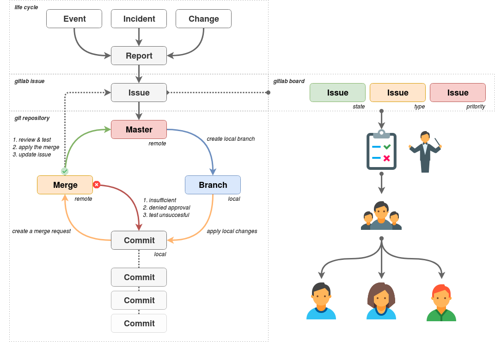

# Ansible guide and Style methods

These sets of documents describe basic guidelines and style methods for using Ansible. A consistent base provides a good structure and improves standardization. It is not meant as a tutorial, these are guidelines. Keep in mind that this document can evolve in the future due to software changes different internal needs and requirements. Make sure to update this document as these changes take place.

# Table of Contents

- [Index (this readme file)](README.md)
- [Playbooks and Plays](Playbooks_and_Plays.md)
- [Tasks in General](Tasks_in_General.md)
- [Tags](Tags.md)
- [Variable naming](Variable_naming.md)
- [Ansible roles](Ansible_roles.md)
- [Zen of Python](Zen_of_Python.md)

# Ansible documentation

Don't be a stranger to the Ansible documentation, such as:

- [Best practices](https://docs.ansible.com/ansible/latest/user_guide/playbooks_best_practices.html)
- [Using variable](https://docs.ansible.com/ansible/latest/user_guide/playbooks_variables.html)
- [Vault](https://docs.ansible.com/ansible/latest/user_guide/vault.html)
- [Module index](https://docs.ansible.com/ansible/latest/modules/modules_by_category.html)

# Use Git

Make sure to use version control as much as possible. All text based files should reside in a git repository. Large files such as compressed archives and binaries are not suitable to be tracked in a git repository. Make sure to have specified a single source as git server where the entire team and organization have access to.

# Git workflow

Use a git workflow for the entire git cycle.

1. Each repository should have a primary branch, something like: **master**
2. Reduce complexity by reducing the amount of unnecessary branches.
3. Every change to the repository, should be logged as an issue in an issue tracking application.
4. Make use of issue templates in order to keep a standardized layout with mandatory and optional sections.
5. Ensure the issue contains all the required details to work with.
6. Use labels to track **status**, **priority** and **type** for each issue.
7. Ensure the issues are scoped and prioritized before work commences.
8. Always branch off from the **master** to start working on a **task**.
9. The branch name must start with the string **"issue_"** followed by the **ID** of the issue. Additionally the name can contain some descriptive words. For example **"issue_23"** or **"issue_23_add_user"**
10. Commit changes with a good descriptive summary, preferably make use of a commit message template.
11. Merge back to the **master** branch with a **merge request**.
12. Ensure the merge request is **tested** and **reviewed** before merging to **master**.
